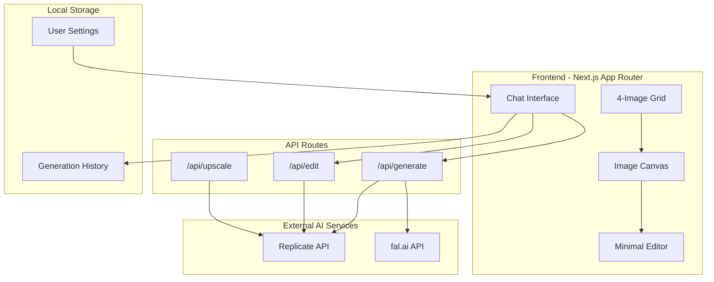
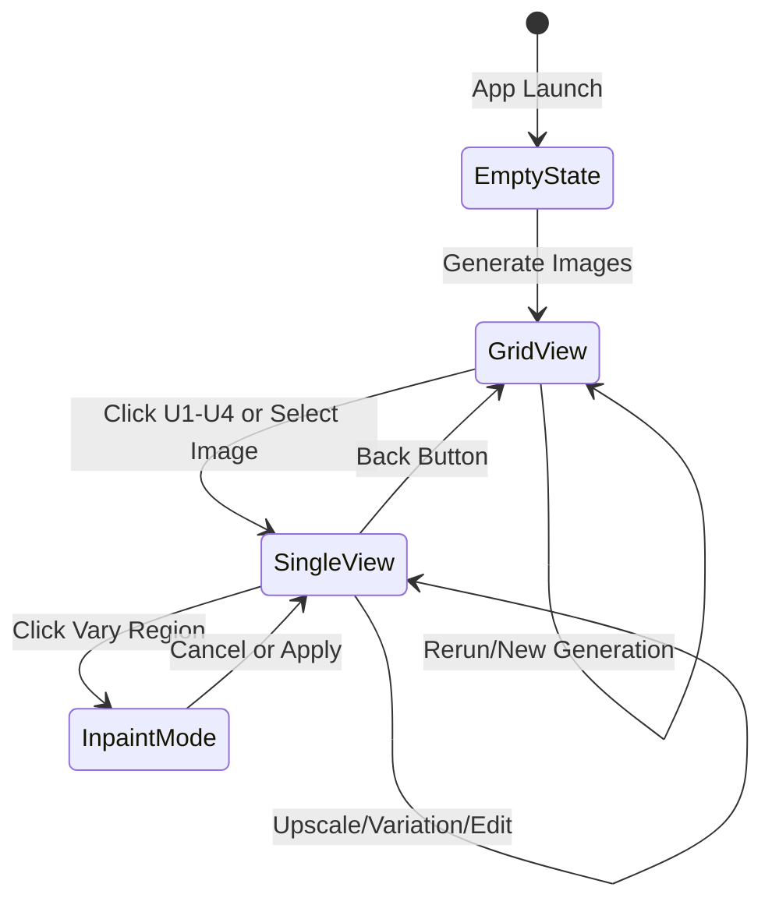
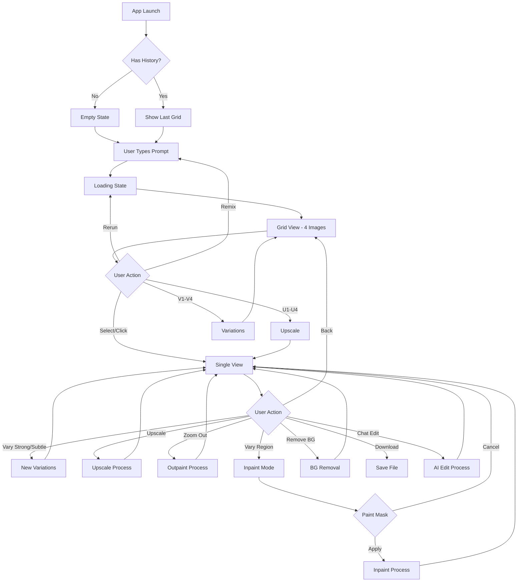

# AI Image Generation Chat App - MVP Plan

## Overview

Build a Next.js app in the `apps/` folder that combines chat-based AI image generation (like Midjourney) with minimal manual editing capabilities from TUI Image Editor.

## Architecture




## Project Structure

```
apps/ai-image-studio/
├── app/
│   ├── layout.tsx              # Root layout with providers
│   ├── page.tsx                # Main app page
│   ├── api/
│   │   ├── generate/route.ts   # Image generation endpoint
│   │   ├── edit/route.ts       # Inpainting/editing endpoint
│   │   ├── upscale/route.ts    # Upscaling endpoint
│   │   └── remove-bg/route.ts  # Background removal endpoint
│   └── globals.css
├── components/
│   ├── chat/
│   │   ├── ChatPanel.tsx       # Chat message list + input
│   │   ├── ChatInput.tsx       # Prompt input with attachments
│   │   └── Message.tsx         # Individual message component
│   ├── canvas/
│   │   ├── ImageGrid.tsx       # 4-image Midjourney-style grid
│   │   ├── ImageCanvas.tsx     # Single image view
│   │   ├── ActionButtons.tsx   # U1-U4, V1-V4, Remix buttons
│   │   └── MaskEditor.tsx      # Brush tool for inpainting masks
│   ├── ui/
│   │   ├── ModelSelector.tsx   # AI model dropdown
│   │   ├── ParameterPanel.tsx  # Aspect ratio, style options
│   │   └── HistoryStrip.tsx    # Recent generations thumbnail strip
│   └── providers/
│       └── AppProvider.tsx     # State management wrapper
├── lib/
│   ├── ai/
│   │   ├── replicate.ts        # Replicate API wrapper
│   │   ├── fal.ts              # fal.ai API wrapper
│   │   └── models.ts           # Model definitions & configs
│   ├── store.ts                # Zustand store
│   └── utils.ts                # Helper functions
├── hooks/
│   ├── useGeneration.ts        # Generation state & polling
│   └── useImageHistory.ts      # Local storage history
├── types/
│   └── index.ts                # TypeScript interfaces
├── package.json
├── next.config.js
├── tailwind.config.js
└── tsconfig.json
```

## Key Components

### 1. Chat Panel (Primary Interface)

The chat interface handles all user interactions:

```typescript
// components/chat/ChatInput.tsx
interface ChatInputProps {
  onSubmit: (prompt: string, attachments?: File[]) => void;
  model: AIModel;
  onModelChange: (model: AIModel) => void;
}
```

Features:

- Text input with placeholder suggestions
- Image upload/drop zone for editing workflows
- Model selector dropdown (FLUX 2 Pro, Klein, etc.)
- Quick parameter buttons (aspect ratio, style)

### 2. Image Grid (Midjourney-Style)

Display 4 generated images with action buttons:

```typescript
// components/canvas/ImageGrid.tsx
interface ImageGridProps {
  images: GeneratedImage[];
  onUpscale: (index: number) => void;    // U1-U4
  onVariation: (index: number) => void;  // V1-V4
  onSelect: (index: number) => void;     // View single
}
```

### 3. Action Buttons

```typescript
// components/canvas/ActionButtons.tsx
const actions = {
  upscale: { model: 'real-esrgan', label: 'U' },
  variation: { model: 'flux-redux', label: 'V' },
  remix: { model: 'flux-kontext', label: 'Remix' },
  outpaint: { model: 'flux-fill', label: 'Zoom Out' },
  inpaint: { model: 'flux-fill', label: 'Vary Region' },
};
```

### 4. Mask Editor (Minimal TUI Integration)

Only for inpainting selection - uses canvas drawing:

```typescript
// components/canvas/MaskEditor.tsx
interface MaskEditorProps {
  image: string;
  onMaskComplete: (maskDataUrl: string) => void;
  brushSize: number;
}
```

Simple brush tool implementation (no need for full TUI editor):

- Freehand brush drawing
- Eraser mode
- Brush size slider
- Clear/Undo

## AI Model Integration

### Supported Models (MVP)


| Task               | Model          | Provider  | Endpoint         |
| ------------------ | -------------- | --------- | ---------------- |
| Generation         | FLUX 2 Pro     | fal.ai    | `/api/generate`  |
| Fast Gen           | FLUX.1 Schnell | Replicate | `/api/generate`  |
| Variations         | FLUX Redux     | Replicate | `/api/edit`      |
| Inpaint/Outpaint   | FLUX Fill      | Replicate | `/api/edit`      |
| Upscale            | Real-ESRGAN    | Replicate | `/api/upscale`   |
| Background Removal | Bria RMBG 2.0  | Replicate | `/api/remove-bg` |


### API Route Example

```typescript
// app/api/generate/route.ts
import Replicate from 'replicate';

export async function POST(req: Request) {
  const { prompt, model, aspectRatio } = await req.json();
  
  const replicate = new Replicate({
    auth: process.env.REPLICATE_API_TOKEN,
  });
  
  const output = await replicate.run(
    "black-forest-labs/flux-schnell",
    { input: { prompt, aspect_ratio: aspectRatio } }
  );
  
  return Response.json({ images: output });
}
```

## State Management (Zustand)

```typescript
// lib/store.ts
interface AppState {
  // Chat
  messages: Message[];
  addMessage: (msg: Message) => void;
  
  // Generation
  isGenerating: boolean;
  currentImages: string[];
  selectedImage: string | null;
  
  // Settings
  model: AIModel;
  aspectRatio: AspectRatio;
  
  // History (persisted to localStorage)
  history: GeneratedImage[];
}
```

## UI Layouts and Flow

The app has three main view states that transition based on user actions:




---

### View 1: Empty State (Initial Launch)

When the app first loads or no images are generated yet:

```
┌─────────────────────────────────────────────────────────────────────────────┐
│  [=]  AI Image Studio                                    [Settings]  [New]  │
├─────────────────────────────────────────────────────────────────────────────┤
│                                                                             │
│                                                                             │
│                                                                             │
│                     ┌─────────────────────────────────┐                     │
│                     │                                 │                     │
│                     │      [Sparkles Icon]            │                     │
│                     │                                 │                     │
│                     │   What will you create today?   │                     │
│                     │                                 │                     │
│                     │   ┌───────────────────────────┐ │                     │
│                     │   │ Describe your image...    │ │                     │
│                     │   └───────────────────────────┘ │                     │
│                     │                                 │                     │
│                     │   [Upload Image]  [Model: v]    │                     │
│                     │                                 │                     │
│                     └─────────────────────────────────┘                     │
│                                                                             │
│         Quick Start:  [Portrait]  [Landscape]  [Abstract]  [Product]       │
│                                                                             │
│                                                                             │
├─────────────────────────────────────────────────────────────────────────────┤
│  Recent: (empty - "Your creations will appear here")                        │
└─────────────────────────────────────────────────────────────────────────────┘
```

**Behavior:**

- Centered prompt input as the focal point
- Quick start chips for common styles
- Upload button for image-to-image workflows
- Model selector visible but secondary
- History strip shows placeholder text

---

### View 2: Grid View (4-Image Generation Results)

After submitting a prompt, shows Midjourney-style 2x2 grid:

```
┌─────────────────────────────────────────────────────────────────────────────┐
│  [=]  AI Image Studio                                    [Settings]  [New]  │
├────────────────────────────────────────────────────┬────────────────────────┤
│                                                    │                        │
│              IMAGE GRID (2x2)                      │      CHAT PANEL        │
│                                                    │                        │
│   ┌───────────────────┐ ┌───────────────────┐      │  ┌──────────────────┐  │
│   │                   │ │                   │      │  │ You:             │  │
│   │                   │ │                   │      │  │ "A cyberpunk     │  │
│   │     IMAGE 1       │ │     IMAGE 2       │      │  │  city at night"  │  │
│   │                   │ │                   │      │  └──────────────────┘  │
│   │                   │ │                   │      │                        │
│   │  [U1]       [V1]  │ │  [U2]       [V2]  │      │  ┌──────────────────┐  │
│   └───────────────────┘ └───────────────────┘      │  │ AI:              │  │
│   ┌───────────────────┐ ┌───────────────────┐      │  │ Here are 4       │  │
│   │                   │ │                   │      │  │ variations!      │  │
│   │                   │ │                   │      │  │ [4 thumbnails]   │  │
│   │     IMAGE 3       │ │     IMAGE 4       │      │  └──────────────────┘  │
│   │                   │ │                   │      │                        │
│   │                   │ │                   │      │  ─────────────────────  │
│   │  [U3]       [V3]  │ │  [U4]       [V4]  │      │                        │
│   └───────────────────┘ └───────────────────┘      │  ┌──────────────────┐  │
│                                                    │  │ Type message...  │  │
│   ┌─────────────────────────────────────────────┐  │  │                  │  │
│   │ [Rerun All] [Remix] [Zoom Out] [Vary Region]│  │  │ [Attach] [Send]  │  │
│   └─────────────────────────────────────────────┘  │  └──────────────────┘  │
│                                                    │  [Model: FLUX Pro v]   │
├────────────────────────────────────────────────────┴────────────────────────┤
│  Recent: [img] [img] [img] [img] [img] [img] [img]           [View All ->]  │
└─────────────────────────────────────────────────────────────────────────────┘
```

**Button Functions:**

- `U1-U4` = Upscale that image (transitions to Single View with high-res)
- `V1-V4` = Create 4 new variations of that image (stays in Grid View)
- `Rerun All` = Regenerate all 4 with same prompt
- `Remix` = Opens prompt editor pre-filled, regenerates
- `Zoom Out` = Outpaint all 4 (extend canvas)
- `Vary Region` = Select an image first, then enter Inpaint Mode

**Hover Behavior:**

- Hovering an image shows overlay with `[Select]` button
- Clicking `[Select]` transitions to Single View for that image

---

### View 3: Single Image View (After Selection/Upscale)

Full-size view of one selected image with editing actions:

```
┌─────────────────────────────────────────────────────────────────────────────┐
│  [<- Back]  AI Image Studio                              [Settings]  [New]  │
├────────────────────────────────────────────────────┬────────────────────────┤
│                                                    │                        │
│              SINGLE IMAGE VIEW                     │      CHAT PANEL        │
│                                                    │                        │
│   ┌────────────────────────────────────────────┐   │  ┌──────────────────┐  │
│   │                                            │   │  │ You:             │  │
│   │                                            │   │  │ "Upscale image 2"│  │
│   │                                            │   │  └──────────────────┘  │
│   │                                            │   │                        │
│   │                                            │   │  ┌──────────────────┐  │
│   │           SELECTED IMAGE                   │   │  │ AI:              │  │
│   │           (Full Resolution)                │   │  │ Upscaled to 4x!  │  │
│   │                                            │   │  │ [image preview]  │  │
│   │                                            │   │  └──────────────────┘  │
│   │                                            │   │                        │
│   │                                            │   │  ─────────────────────  │
│   │                                            │   │                        │
│   └────────────────────────────────────────────┘   │  ┌──────────────────┐  │
│                                                    │  │ Describe edits...│  │
│   ┌─────────────────────────────────────────────┐  │  │                  │  │
│   │ QUICK ACTIONS:                              │  │  │ [Attach] [Send]  │  │
│   │                                             │  │  └──────────────────┘  │
│   │ [Vary Strong] [Vary Subtle] [Upscale 2x]   │  │                        │
│   │ [Zoom Out 1.5x] [Zoom Out 2x]              │  │  Suggested:            │
│   │ [Vary Region] [Remove BG] [Download]       │  │  - "Make it darker"    │
│   │                                             │  │  - "Add more neon"    │
│   └─────────────────────────────────────────────┘  │  - "Remove the car"   │
│                                                    │                        │
├────────────────────────────────────────────────────┴────────────────────────┤
│  Recent: [img] [img] [img] [img] [img] [img] [img]           [View All ->]  │
└─────────────────────────────────────────────────────────────────────────────┘
```

**Quick Actions Explained:**

- `Vary Strong` = High variation (FLUX Redux, strength 0.8)
- `Vary Subtle` = Low variation (FLUX Redux, strength 0.3)
- `Upscale 2x` = Real-ESRGAN 2x upscale
- `Zoom Out 1.5x/2x` = FLUX Fill outpaint with ratio
- `Vary Region` = Enter Inpaint Mode (see below)
- `Remove BG` = Bria RMBG background removal
- `Download` = Save to device

**Chat Panel Behavior:**

- Shows contextual suggestions based on current image
- User can type natural language edits: "Make the sky more purple"
- AI interprets and applies appropriate model

---

### View 4: Inpaint Mode (Vary Region)

Activated from Single View when user clicks "Vary Region":

```
┌─────────────────────────────────────────────────────────────────────────────┐
│  [X Cancel]  Vary Region - Paint the area to change        [Apply ->]       │
├─────────────────────────────────────────────────────────────────────────────┤
│                                                                             │
│   ┌─────────────────────────────────────────────────────────────────────┐   │
│   │                                                                     │   │
│   │                                                                     │   │
│   │                                                                     │   │
│   │                    IMAGE WITH MASK OVERLAY                          │   │
│   │                                                                     │   │
│   │              (Red/pink tint shows painted areas)                    │   │
│   │                                                                     │   │
│   │                      ~~~~~~~~~~~                                    │   │
│   │                    ~~ MASKED  ~~                                    │   │
│   │                      ~~ AREA ~~                                     │   │
│   │                        ~~~~~                                        │   │
│   │                                                                     │   │
│   │                                                                     │   │
│   └─────────────────────────────────────────────────────────────────────┘   │
│                                                                             │
│   ┌─────────────────────────────────────────────────────────────────────┐   │
│   │  TOOLBAR:                                                           │   │
│   │                                                                     │   │
│   │  [Brush]  [Eraser]  |  Size: [====O====] 50px  |  [Undo] [Clear]   │   │
│   │                                                                     │   │
│   └─────────────────────────────────────────────────────────────────────┘   │
│                                                                             │
│   ┌─────────────────────────────────────────────────────────────────────┐   │
│   │  Describe what should appear in the masked area:                    │   │
│   │  ┌─────────────────────────────────────────────────────────────┐    │   │
│   │  │ "Replace with a garden"                                     │    │   │
│   │  └─────────────────────────────────────────────────────────────┘    │   │
│   └─────────────────────────────────────────────────────────────────────┘   │
│                                                                             │
└─────────────────────────────────────────────────────────────────────────────┘
```

**Behavior:**

- Full-screen overlay mode (no chat panel - focused editing)
- Simple brush/eraser tools only
- Mask shown as semi-transparent red overlay
- Prompt input for what should replace masked area
- `[Apply]` sends to FLUX Fill API with mask + prompt
- `[Cancel]` returns to Single View without changes
- After apply, returns to Single View with new image

---

### View 5: Loading/Generation State

Shown during any AI operation:

```
┌─────────────────────────────────────────────────────────────────────────────┐
│  [=]  AI Image Studio                                    [Settings]  [New]  │
├────────────────────────────────────────────────────┬────────────────────────┤
│                                                    │                        │
│              LOADING STATE                         │      CHAT PANEL        │
│                                                    │                        │
│   ┌────────────────────────────────────────────┐   │                        │
│   │                                            │   │  ┌──────────────────┐  │
│   │                                            │   │  │ You:             │  │
│   │          [Animated Shimmer Grid]           │   │  │ "A serene lake   │  │
│   │                                            │   │  │  at sunset"      │  │
│   │              Generating...                 │   │  └──────────────────┘  │
│   │                                            │   │                        │
│   │         ████████████░░░░░░░  67%           │   │  ┌──────────────────┐  │
│   │                                            │   │  │ AI:              │  │
│   │          Model: FLUX 2 Pro                 │   │  │ Generating 4     │  │
│   │          Est. time: ~12 seconds            │   │  │ images...        │  │
│   │                                            │   │  │                  │  │
│   │              [Cancel]                      │   │  │ [typing...]      │  │
│   │                                            │   │  └──────────────────┘  │
│   └────────────────────────────────────────────┘   │                        │
│                                                    │                        │
│                                                    │                        │
├────────────────────────────────────────────────────┴────────────────────────┤
│  Recent: [img] [img] [img] [img] [img] [img] [img]           [View All ->]  │
└─────────────────────────────────────────────────────────────────────────────┘
```

**Loading Indicators:**

- Shimmer placeholder grid (4 boxes animating)
- Progress bar (if API provides progress)
- Estimated time based on model
- Cancel button to abort
- Chat panel shows "typing..." indicator

---

## UI Flow Diagram (User Journey)




---

## Interaction Details

### Chat Input Behavior


| User Input                | Detected Intent            | Action                                           |
| ------------------------- | -------------------------- | ------------------------------------------------ |
| "A sunset over mountains" | Generation                 | Generate 4 new images                            |
| "Make it more vibrant"    | Edit (with selected image) | FLUX Kontext edit                                |
| "Remove the person"       | Inpaint                    | Prompt user to select region OR auto-detect      |
| "Upscale this"            | Upscale                    | Run Real-ESRGAN on current image                 |
| "Create variations"       | Variation                  | Run FLUX Redux                                   |
| Drag & drop image         | Image-to-image             | Ask "What would you like to do with this image?" |


### Keyboard Shortcuts


| Key         | Action                                 |
| ----------- | -------------------------------------- |
| `Enter`     | Submit prompt                          |
| `Escape`    | Cancel current operation / Close modal |
| `Ctrl+Z`    | Undo (in Inpaint Mode)                 |
| `1-4`       | Quick select image 1-4 in Grid View    |
| `U`         | Upscale selected image                 |
| `V`         | Vary selected image                    |
| `Backspace` | Go back to previous view               |


### Responsive Behavior

**Desktop (1200px+):** Side-by-side layout (Canvas | Chat)

**Tablet (768px-1199px):** 

- Stacked layout with collapsible chat
- Grid becomes 2x2 but smaller
- Chat slides in from right as overlay

**Mobile (< 768px):**

- Full-width single column
- Tab navigation: [Canvas] [Chat] [History]
- Grid becomes vertical scroll (1 column)
- Inpaint Mode uses full screen

## Dependencies

```json
{
  "dependencies": {
    "next": "^14.0.0",
    "react": "^18.2.0",
    "react-dom": "^18.2.0",
    "replicate": "^0.25.0",
    "zustand": "^4.4.0",
    "tailwindcss": "^3.4.0",
    "lucide-react": "^0.300.0"
  },
  "devDependencies": {
    "typescript": "^5.0.0",
    "@types/react": "^18.2.0",
    "@types/node": "^20.0.0"
  }
}
```

## Implementation Order

### Phase 1: Foundation (Core Setup)

1. Create Next.js app in `apps/ai-image-studio`
2. Set up Tailwind CSS with dark theme
3. Create basic layout components
4. Set up Zustand store with localStorage persistence

### Phase 2: AI Integration

1. Implement `/api/generate` route with Replicate
2. Add model configuration and switching
3. Implement generation polling/streaming

### Phase 3: Chat Interface

1. Build ChatPanel and ChatInput components
2. Add message rendering with image previews
3. Implement prompt submission flow

### Phase 4: Image Display

1. Build ImageGrid component (4-image layout)
2. Add U1-U4, V1-V4 action buttons
3. Implement single image view mode

### Phase 5: Editing Features

1. Add variation generation (FLUX Redux)
2. Implement upscaling (Real-ESRGAN)
3. Build MaskEditor for inpainting
4. Add inpaint/outpaint endpoints

### Phase 6: Polish

1. Add history strip with thumbnails
2. Implement download functionality
3. Add loading states and error handling
4. Mobile responsive adjustments

## Environment Variables

```env
REPLICATE_API_TOKEN=r8_xxxxxxxxxxxx
FAL_API_KEY=xxxxxxxxxxxx
```

## Key Decisions

1. **No full TUI editor** - Only implement a simple canvas brush for mask selection. The AI handles all complex editing.
2. **Server-side API calls** - All AI provider calls go through Next.js API routes to protect API keys.
3. **4-image grid default** - Match Midjourney UX for familiarity.
4. **Local storage only** - No database for MVP; history persists in browser.
5. **Dark theme** - Match Midjourney's aesthetic with a dark, image-focused UI.

